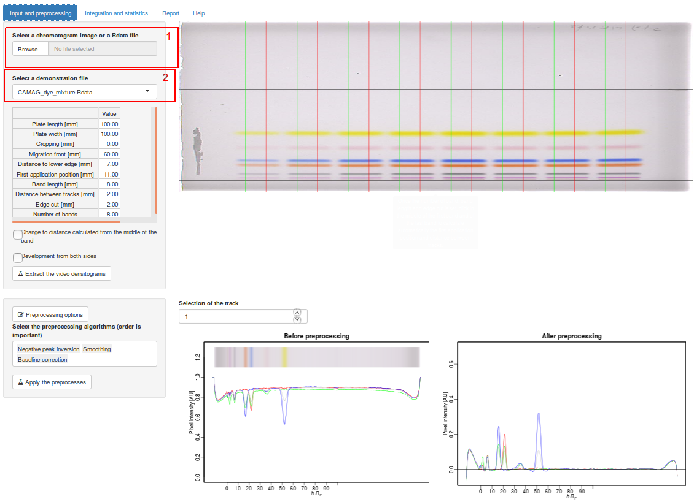
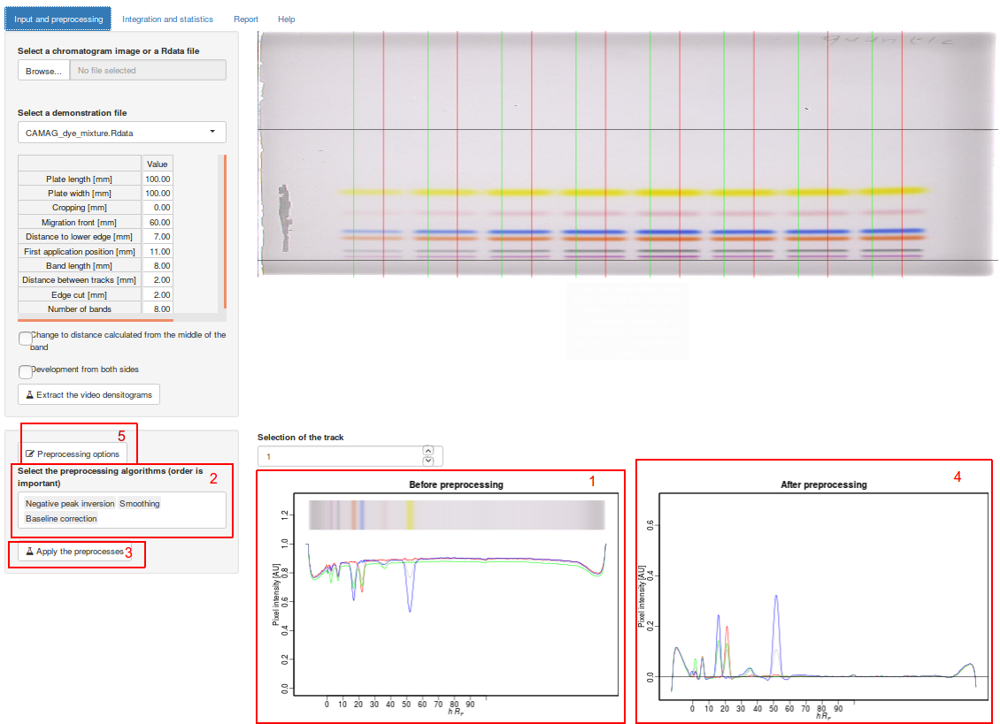
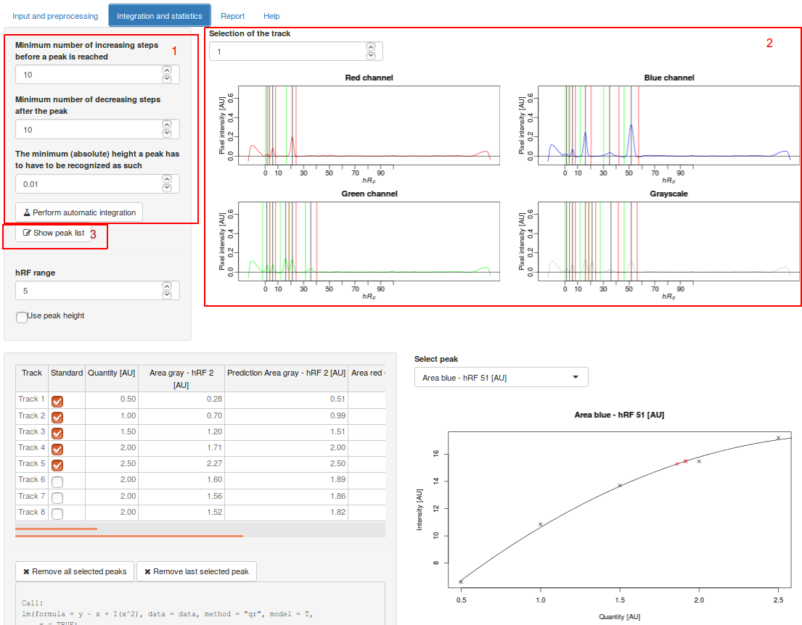
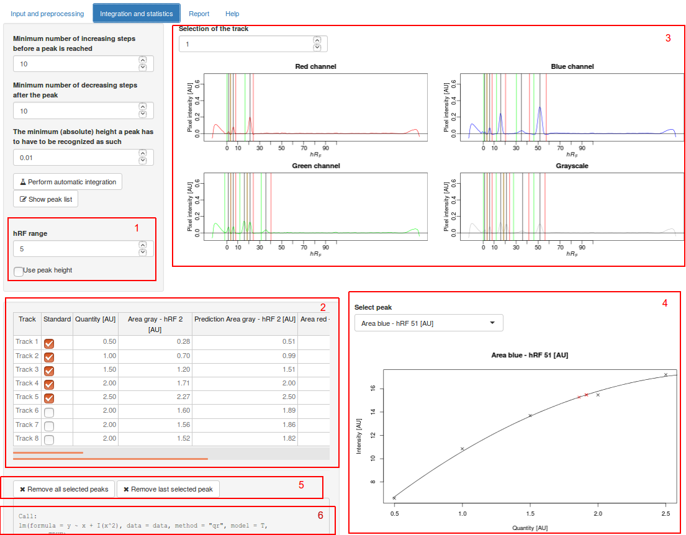
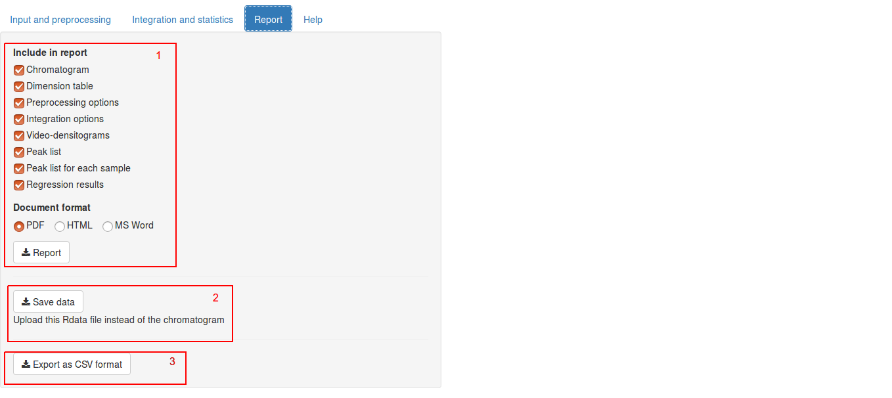

QuanTLC can be accessed online: [134.176.7.66/quanTLC](https://134.176.7.66/quanTLC).

The github repository with the code source is [here](https://github.com/DimitriF/quantlc)

The peer review article is available [here](https://www.sciencedirect.com/science/article/pii/S0021967318306101).

\pagebreak

## Data input

1. Upload an image file (jpeg, png, tiff and bmp are supported). It is also here that a saved file must be uploaded (Cf. Data output section)
2. Optionnaly, select a demonstration data file.

\pagebreak

## Videodensitogram extraction

1. Input the dimensions used during the experiment
2. The chromatogram image update directly the band position, band will be extracted between the green  and red vertical lines.
3. Depending of the convention, it is possible to use change for a calcul from the middle of the band.
4. Check here in case of double side development.
5. Finally, click on this button to  extract the videodensitograms. 

Note that it is possible to extract automatically the dimensions used by clicking on the image (2). Hover the image for instructions.

\pagebreak

## Data preprocessing

1. The raw extracted videodensitograms are plotted.
2. Select a set of preprocessing parameters (normally, smoothing then baselin correction works correctly preceeded by peak inversion if needed).
3. Click on this button to perform the preprocessing.
4. The preprocessed videodensitograms are plotted.
5. Optionnaly, more choices are possible for the preprocessing like the windows of the smoothing and the algorithm used for baseline correction, the default should work though.

\pagebreak

## Peak detection

1. The options used for peak detection and the button for peak detection. Note that this algorithm is not the best and you may need to fine tune the preprocessing if not all peak are detected.
2. The detected peaks are plotted for each channel.
3. It is possible to look in detail at the peak list.

\pagebreak

## Calibration

1. Select the pixel window and if you want to use peak height or area.
2. Input which samples are standard and what is the targeted value for each.
3. Click on a peak on the plot.
4. The calibration curve is plotted, multiple click will lead to multiple calibration. The predicted value for each sample and standard are updated in the table (2)
5. It is possible to remove the selected or all calibration.
6. Information on the model is printed.

\pagebreak

## Data output

1. Select the content and format of the report before downloading it.
2. Save the data as Rdata format to upload it instead of a picture later.
3. Download the data as CSV format to analyse it in an other software or to make your own plot for publication in your software of choice.

